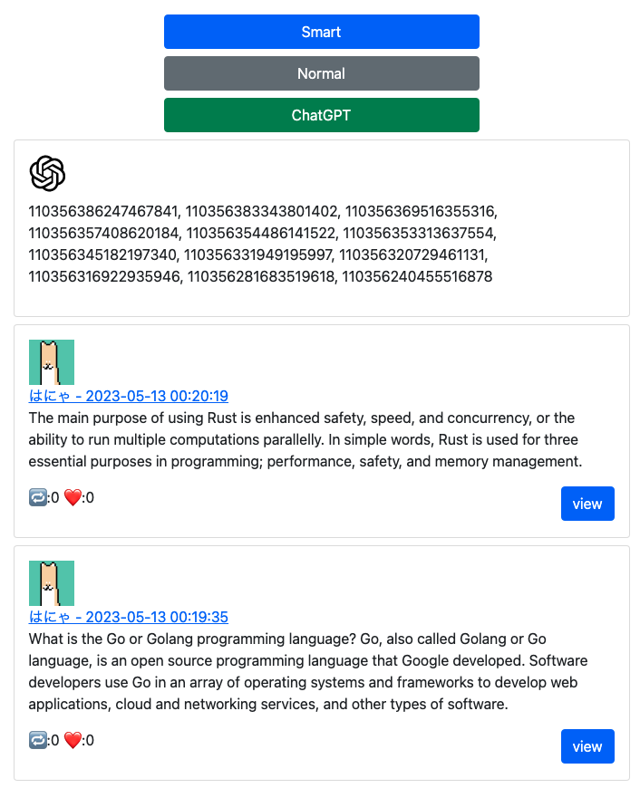

# mastardon



## Overview

It's farewell to not importance toot! (どうでもいいトゥートとはおさらばだ！)

## Features

- Sorted Mastodon Timeline
- Segregate toots using ChatGPT

## Requirement

- python3

## Usage

```sh
sh setup.sh
. ./venv/bin/activate
python manage.py runserver
```

## Reference

https://mastodonpy.readthedocs.io/en/stable/index.html

## Author

[mio256](https://github.com/mio256)

## Licence

MIT License
